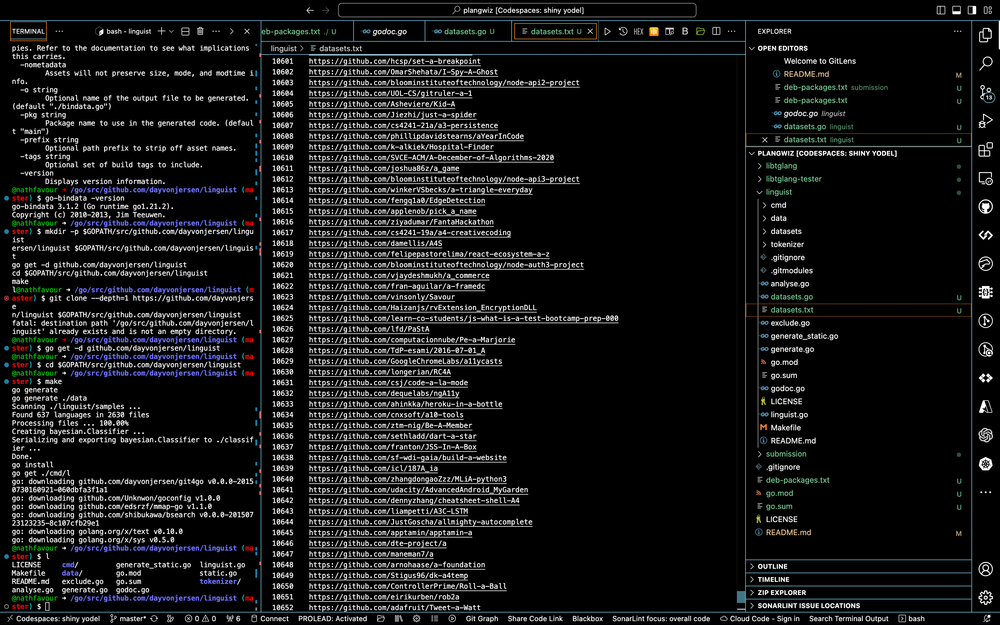

# plangwiz

library for accurate programming language detection.

Takes text snippets, file paths, and folder paths as input.

e.g plangwiz ---text "/absolute/path/to/file"

plangwiz --file "/absolute/path/to/file"

plangwiz --dir "/absolute/path/to/dir"

In each of these cases, plangwiz will return the programming language of the file(s) present in the provided text or path.

NB: It is possible to use relative paths instead by uncommenting the "#no-absolute" line within the settings.txt file in the root dir of this library.

In each of these cases, it detects the programming language(s) of the text, of the file, or of each file in the folder.

Much thanks to the creator of https://github.com/dayvonjersen/linguist, which forms the background of this library.

# Development details

Developed and built on a Macbook pro intel 2020

Works on Debian systems and Macbook

Plangwiz was trained with data from almost 10,000 github public repositories.

# USAGE

prerequesite:

1. Install go with brew install go
